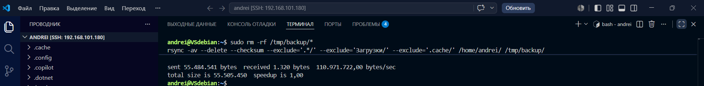
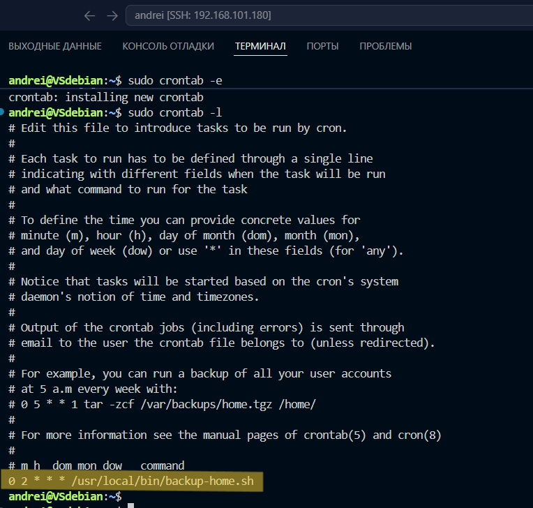
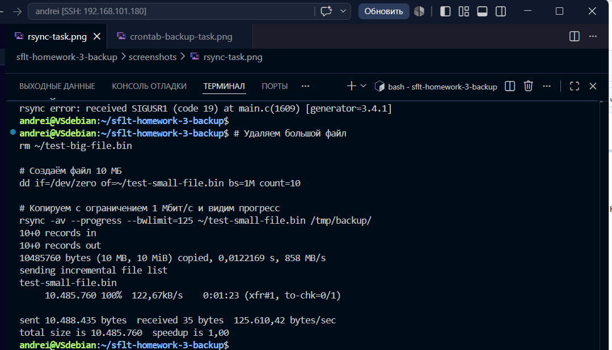
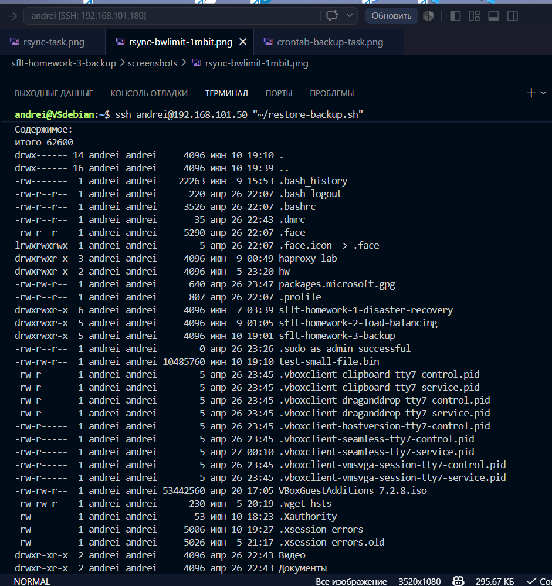

# Домашнее задание к занятию 3 «Резервное копирование»

**Фамилия Имя:** Санакин Андрей

---

## Задание 1: Rsync — зеркальная копия

### Команда
```bash
rsync -av --delete --checksum --exclude='.*/' /home/andrei/ /tmp/backup/
```

### Параметры
| Параметр | Значение |
|----------|----------|
| `-a` | Архивный режим (сохраняет права, времена, симлинки) |
| `-v` | Подробный вывод |
| `--delete` | Удалять лишнее в приёмнике (зеркальная копия) |
| `--checksum` | Сравнивать по хэш-сумме, даже если время/размер совпадают |
| `--exclude='.*/'` | Исключить скрытые директории (начинающиеся с точки) |

### Скриншот
- 

---

## Задание 2: Скрипт + Cron для регулярного бэкапа

### Скрипт
[backup-home.sh](scripts/backup-home.sh)

### Crontab
```bash
0 2 * * * /usr/local/bin/backup-home.sh
```

### Скриншот
- 

---

## Задание 3*: Ограничение скорости rsync

### Команда
```bash
rsync -av --bwlimit=125 ~/test-small-file.bin /tmp/backup/
```

- `--bwlimit=125` — 125 КБ/с = 1 Мбит/с

### Скриншот
- 

---

## Задание 4*: Инкрементное бэкапирование + восстановление

### Скрипт бэкапа
[backup-incremental.sh](scripts/backup-incremental.sh)

### Скрипт восстановления
[restore-backup.sh](scripts/restore-backup.sh)

### Скриншоты
- 
- 

### Параметры
- **Источник:** /home/andrei/
- **Приёмник:** andrei@192.168.101.50:/home/andrei/backups/
- **Хранение:** 5 последних копий
- **Восстановление:** /home/andrei/restored/
